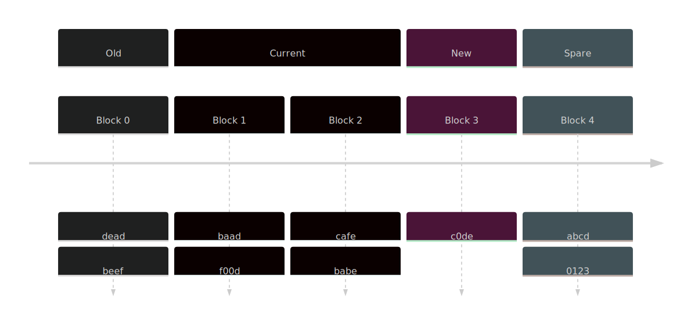
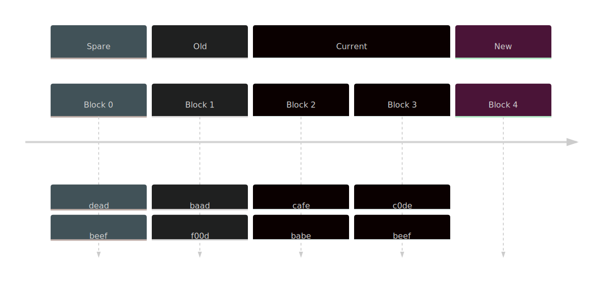

When starting out with remote caching,
an error you are likely to run into is:

```
java.io.IOException: com.google.devtools.build.lib.remote.ExecutionStatusException:
INVALID_ARGUMENT: Failed to store previous blob 1-<HASH>-<LARGE_NUM>:
Shard 1: Blob is <LARGE_NUM> bytes in size,
while this backend is only capable of storing blobs of up to 238608384 bytes in size
```

This is because your storage backend is too small.
You are attempting to upload a blob larger than the largest blob accepted by your storage backend.

## How do I fix it?

The largest blob you can store is the size of your your storage device
divided by the number of blocks in your device.

To store larger blobs,
either increase the size of your storage device
or decrease the number of blocks it is split into. 
Larger storage devices will take more disk,
while fewer blocks will decrease the granularity which your cache works with.

In
[bb-deployments](https://github.com/buildbarn/bb-deployments)
this setting is found in
[storage.jsonnet](https://github.com/buildbarn/bb-deployments/blob/d63c032b2b4d96f93cb889f95add15c26118d771/docker-compose/config/storage.jsonnet).

```js
{
  // ...
  contentAddressableStorage: {
    backend: {
      'local': {
        // ...
        oldBlocks: 8,
        currentBlocks: 24,
        newBlocks: 1,
        blocksOnBlockDevice: {
          source: {
            file: {
              path: '/storage-cas/blocks',
              sizeBytes: 8 * 1024 * 1024 * 1024, // 8GiB
            },
          },
          spareBlocks: 3,
        },
        // ...
      },
    },
  },
  // ...
}
```

To facilitate getting started bb-deployments emulates a block device by using an 8GiB large file.
This file is small enough to fit most builds while not taking over the disk completely from a developers machine.

The device is then split into 36 blocks (8+24+1+3),
where each block can then store a maximum of 238608384 bytes (8GiB / 36 - some alignment).

In production it is preferable to use a large raw block device for this purpose.

## What does new/old/current/spare mean?

In depth documentation about all the settings are available in the
[configuration proto files](https://github.com/buildbarn/bb-storage/blob/master/pkg/proto/configuration/blobstore/blobstore.proto).

In essence the storage works as a ringbuffer where the assignment of each block is rotated. 
Consider a 5 block configuration with 1 old, 2 current, 1 new and 1 spare block.



As data is referenced from an old block
it gets written into a new block.
When the new block is full the role rotates.




There are some tradeoffs in behaviour to consider when choosing your block layout. Fewer blocks will allow larger individual blobs at the cost of granularity. Here is a quick summary of the meaning of the different fields.

* **Old** - Region where reads are actively copied over to new, too small value and your device behaves more like a FIFO than a LRU cache, too large and your device does a lot of uneccesary copying.
* **Current** - Stable region, should be the majority of your device.
* **New** - Region for writing new data to, must be 1 for AC and should be 1-4 for CAS. Having a couple of new blocks allows data to be better spread out over the device so as to not expire at the same time.
* **Spare** - Region for giving ongoing reads some time to finish before data starts getting overwritten.
