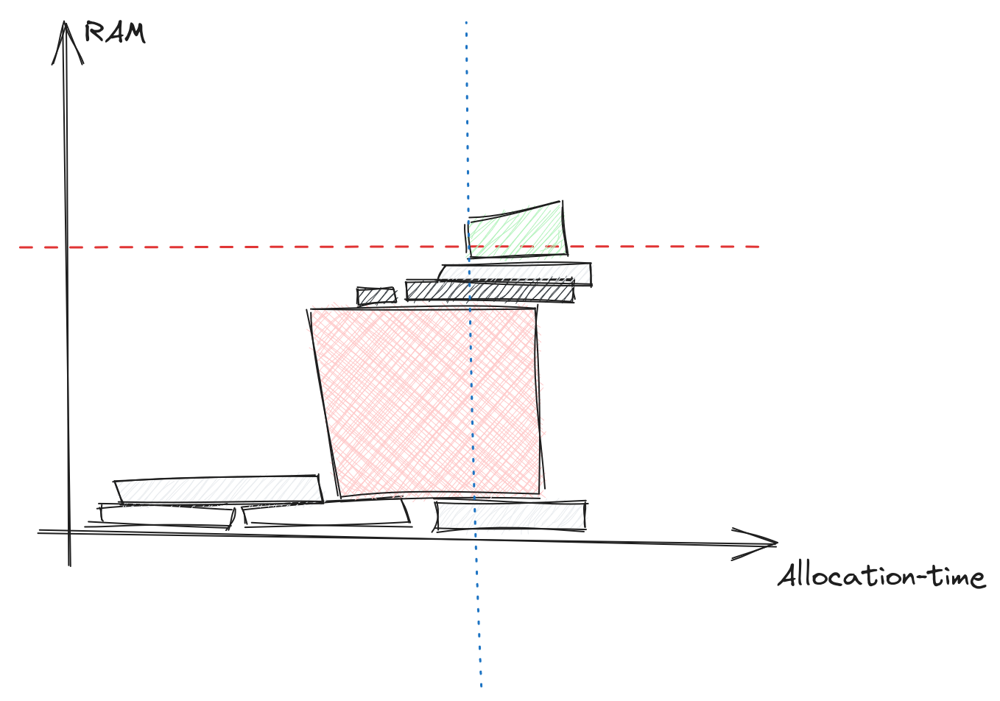
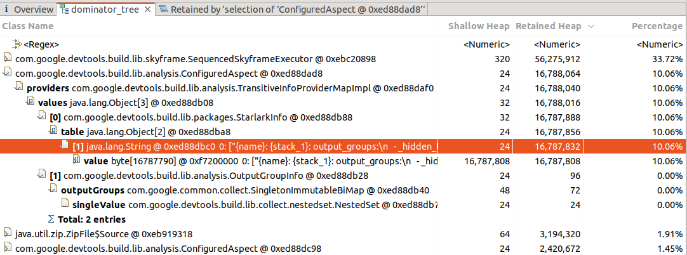
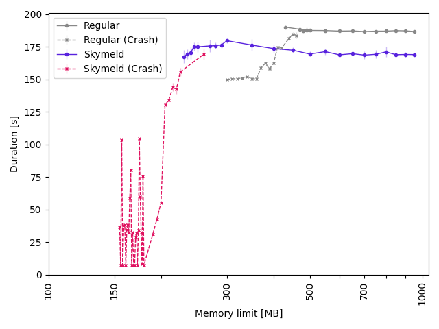
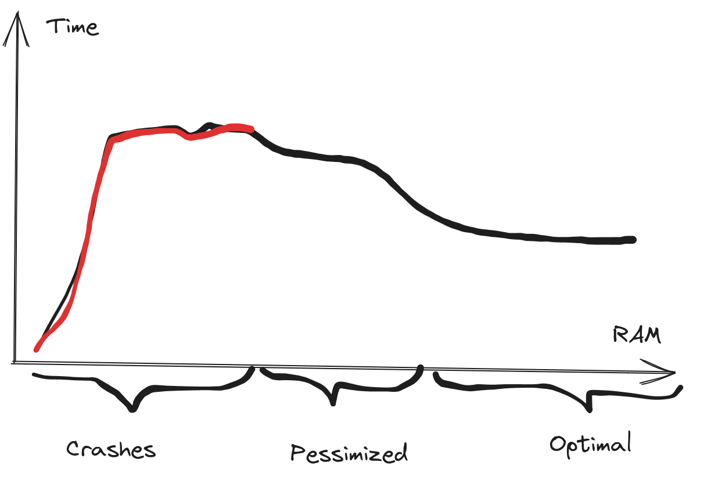
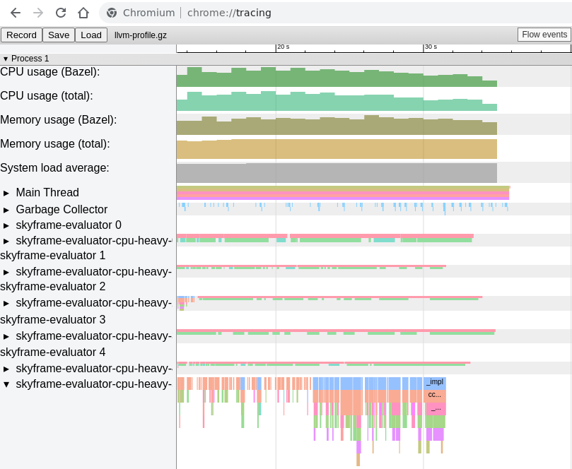

# Dude, where is the RAM?

  An adventure in finding a memory thief in Starlark-land

This is a summary and follow-up to [my talk] at BazelCon-2023.
With abridged code examples, the full instructions are available [together with the code].

[my talk]: https://www.youtube.com/watch?v=IXimf4DCAoY#t=7h21m57s
[together with the code]: https://github.com/meroton/memory-adventure

## Problem Statement

First, we lament Bazel's out-of-memory errors,
  and point out that the often useful Starlark stacktrace does not always show up.
Some allocation errors just crash Bazel without giving and indication of which allocation failed.



This diagram illustrates a common problem for memory errors,
the allocation that fails may not be the problem,
it is just the straw that breaks the camel's back.
And the real thief may already have allocated its memory.

We have seen many errors when working with clients,
and they typically hide in big corporate code bases.
Which complicates troubleshooting, discussion and error reporting.
So we create a synthetic repository to try to illustrate the problem,
and have something to discuss.
The code and instructions are available [here].

Errors and poor performance in the analysis phase
are not good at all.
This is because the analysis must always be done
before starting to build all actions.
With big projects the number of configuration to build for can be very large,
so one cannot rely on CI runners to build the same configuration over and over,
to retain the analysis cache.
Instead it is on the critical-path for all builds,
especially if the actions themselves are cached remotely.

To illustrate (some of the problem) we have a reproduction repository
with example code base with some Python and C programs.
To introduce memory problems, and make it a little more complex
we add two rules: one CPU intensive rule ("spinlock")
and one memory intensive aspect ("traverse").
The "traverse" aspect encodes the full dependency tree of all targets
and writes that to a file with `ctx.actions.write`.
So the allocations are tied to the Action object.

[here]: https://github.com/meroton/memory-adventure

## Toolbox

We have a couple of tools available, many are discussed in the [memory optimization guide],
but we find that some problems can slip through the cracks.

First off, there are the post-build analysis tools in bazel:

  * `bazel info`
  * `bazel dump --rules`
  * `bazel aquery --skyframe_state`

These are a good starting point and have served us well on many occasions.
But with this project they seem to miss some allocations
We will return to that later.
Additionally, these tool will not give any information if the Bazel server crashes.
You will need to increase the memory and run the same build again.

Then one can use Java tools to inspect what the JVM is doing:

  * [Eclipse Memory Analyzer]
  * `jmap`

The best approach here is to ask Bazel to save the heap if it crashes,
so it can be analyzed post-mortem: `bazel --heap_dump_on_oom`

And lastly, use Bazel's profiling information:

  * `bazel --profile=profile.gz --generate_json_trace_profile --noslim_profile`

This contains structured information
and is written continuously to disk,
so if Bazel crashes we can still parse it,
we just need to discard partially truncated events.

[Eclipse Memory Analyzer]: https://eclipse.dev/mat/documentation/
[memory optimization guide]: https://bazel.build/rules/performance#memory-profiling

## Expected Memory consumption

As the two rules write their string allocations to output files
we get a clear picture of the expected RAM usage (or at least a lower bound).

```
$ bazel clean
$ bazel build \
  --aspects @example//memory:eat.bzl%traverse \
  --output_groups=default,eat_memory \
  //...
# Memory intensive tree traversal (in KB)
$ find bazel-out/ -name '*.tree' | xargs du | cut -f1 | paste -sd '+' | bc
78504
# CPU intensive spinlocks (in KB)
$ find bazel-out/ -name '*.spinlock' | xargs du | cut -f1 | paste -sd '+' | bc
3400
```

Here is a table with the data:

|  | Memory for each target | Total |
| ---- | ---- | ----------- |
| Memory intensive | 0-17 MB | 79 MB |
| CPU intensive | 136 KB |  3.4 MB |

## Reported Memory Consumption

Next, we check with the diagnostic tools.

```
$ bazel version
Bazelisk version: development
Build label: 6.4.0
```

### Bazel dump --rules

```
$ bazel $STARTUP_FLAGS --host_jvm_args=-Xmx"10g" dump --rules
Warning: this information is intended for consumption by developers
only, and may change at any time. Script against it at your own risk!

RULE                              COUNT     ACTIONS          BYTES         EACH
cc_library                            4          17        524,320      131,080
native_binary                         1           4        524,288      524,288
cc_binary                             6          54        262,176       43,696
toolchain_type                       14           0              0            0
toolchain                            74           0              0            0
...

ASPECT                             COUNT     ACTIONS          BYTES         EACH
traverse                              85          81        262,432        3,087
spinlock14                            35          66        524,112       14,974
spinlock15                            35          66              0            0
...
```

First, there are some common rules that we do not care about here,
then we have the Aspects.
`traverse` is the memory intensive aspect,
which is applied on the command line
and `spinlock<N>` are the CPU intensive rules,
with identical implementations just numbered (there are 25 of them).

It is a little surprising that only one have allocations.
And the action count for each aspect does not make sense either,
as this is not a transitive aspect.
It just runs a single action each time the rule is instantiated.
The hypothesis is that this is a display problem,
with code shared between rules.
There are 25 rules, with 25 distinct implementation functions,
but they in turn call the same function with the action.
So the "count" and "actions" columns are glued together,
but the "bytes" is reported for just one of the rules (it would be bad if this was double-counted).

Either way,
the total number of bytes does not add up to what we expect.
Compare the output to the lower-bound determined before:

|  | Memory for each target | Total | Reported Total |
| ---- | ---- | ----------- |
| Memory intensive | 0-17 MB | 79 MB | 262 kB
| CPU intensive | 136 KB |  3.4 MB | 524 kB

### Skylark Memory Profile

:::info
This is not part of the video.
:::

The skylark memory profiler is much more advanced,
and can be dumped after a successful build.

```
$ bazel $STARTUP_FLAGS --host_jvm_args=-Xmx"$mem" dump \
    --skylark_memory="$dir/memory.pprof"
```

```
$ pprof manual/2023-10-30/10g-2/memory.pprof
Main binary filename not available.
Type: memory
Time: Oct 30, 2023 at 12:16pm (CET)
Entering interactive mode (type "help" for commands, "o" for options)
(pprof) top
Showing nodes accounting for 2816.70kB, 73.34% of 3840.68kB total
Showing top 10 nodes out of 19
      flat  flat%   sum%        cum   cum%
     512kB 13.33% 13.33%      512kB 13.33%  impl2
  256.16kB  6.67% 20.00%   256.16kB  6.67%  traverse_impl
  256.11kB  6.67% 26.67%   256.11kB  6.67%  _add_linker_artifacts_output_groups
  256.09kB  6.67% 33.34%   256.09kB  6.67%  alias
  256.09kB  6.67% 40.00%   256.09kB  6.67%  rule
  256.08kB  6.67% 46.67%   256.08kB  6.67%  to_list
  256.06kB  6.67% 53.34%   256.06kB  6.67%  impl7
  256.04kB  6.67% 60.01%   256.04kB  6.67%  _is_stamping_enabled
  256.04kB  6.67% 66.67%   256.04kB  6.67%  impl18
  256.03kB  6.67% 73.34%   768.15kB 20.00%  cc_binary_impl
```

Here the Memory intensive aspect shows up with 256kB,
which is inline with the output from `bazel dump --rules`,
but not reflecting the big allocations we knows it makes.

### Eclipse Memory Analyzer

The final tool we have investigated is the Java heap analysis tool
[Eclipse Memory Analyzer],
which can easily be used with Bazel's `--heap_dump_on_oom` flag.
On the other hand it is a little tricker to find a heap dump from a successful build.



Here we see the (very) big allocation clear as day,
but have no information of its provenance.

We have not found how to track this back to a Skylark function, Skyframe evaluator
or anything that could be cross-referenced with the profiling information.

## Build Time

The next section of the talk shows the execution time of the build
with varying memory limits.



This is benchmarked with 5 data points for each memory limit,
and the plot shows failure if there was at least one crash among the data points.
There is a region where the build starts to succeed more and more often, but sometimes crashes.
So the Crash and not-crash graphs overlap a little,
you want to have some leeway to avoid flaky builds from occasional out-of-memory crashes.

We see that the Skymeld graph requires a lot less memory than a regular build,
that is because our big allocations are all tied to Action objects.
Enabling Skymeld lets Bazel start executing Actions as soon as they are ready,
so the resident set of Action objects does not grow so large,
and the allocations can be freed much sooner.

## Pessimization with limited memory



We saw a hump in the build time for the Skymeld graph,
where the builds did succeed in the 300 - 400 MB range,
but the build speed gradually increased, reaching a plateau at around 500 MB.
This is a pattern we have seen before,
where more RAM, or more efficient rules can improve build performance.

This is probably because the memory pressure and the Java Garbage Collector
interferes with the Skyframe work.
See [Benjamin Peterson's great talk] about the Skyframe for more information.

[Benjamin Peterson's great talk]: https://www.youtube.com/watch?v=8Dc8R_Zrf6M&t=3039s

## Future work



This section details future work for more tools and signals
that we can find from Bazel's profile information
`--profile=profile.gz --generate_json_trace_profile --noslim_profile`.
Written in the standard `chrome://tracing` format
it is easy to parse for both successful and failed builds.

This contains events for the garbage collector,
and all executed Starlark functions.

These can be correlated
to find which functions are active during, or before, garbage collection events.
Additionally, one could collect this information for all failed builds,
and see if some functions are overrepresented
among the last active functions for each evaluator in the build.
