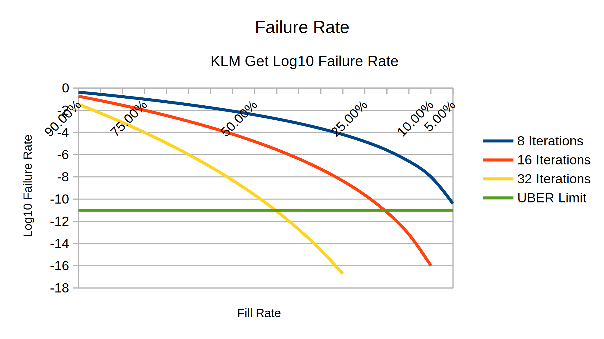

When running a remote cache and execution cluster based on Buildbarn the Key
Location Map (KLM) is a term that you will run into and it is important to take
proper care when sizing the KLM and the number of KLM attempts.

# How big should the KLM be?

If you are just looking for a ballpark number to get you started, set the
number of get attempts to 16 and the number of put attempts to 64 and use the
following table.

|                     | CAS       | AC        |
| ------------------- | --------- | --------- |
| Average Object Size | 500KB     | 1KB       |
| Storage Size        | 1TB       | 1GB       |
| KLM Entries         | 8 000 000 | 4 000 000 |
| KLM Size            | 528MB     | 264MB     |

I recommend reading the rest of the article to understand what you are actually
setting and how to reason about this.

# How does the KLM work?

The KLM is a [hash table](https://en.wikipedia.org/wiki/Hash_table) which
describes the position in your storage layer where your desired data is written
and is indexed by hashing the key of your storage data.

Given a limited key space hash functions will have collisions, it is therefore
important that the KLM is significantly larger than required for fitting a key
for every object. To keep the likelihood of a collision low a naive
implementation would require an enourmous hash table but using a technique
called Robin Hood hashing this requirement can be kept down to a small factor
larger than the size of the key set requirement.

For example, in a blobstore which can fit `n` objects and that has a KLM which
can fit `2n` entries every hash would have a 50% chance of corresponding to an
already occupied slot. With Robin Hood hashing we can repeat this process
multiple times by incrementing an attempts counter giving us multiple possible
locations for the same object.

When querying for an object we can then search up to the maximum number of
allowed iterations to find our object in one of these slots. When inserting we
perform a similar solution, namely incrementing the number of attempts whenever
we encounter a collision but taking care to insert the younger of the colliding
objects in the colliding slot and pushing the older object forward.

The number of attempts we allow the KLM to look for a free slot is described by the two parameters `key_location_map_maximum_get_attempts` and the `key_location_map_maximum_put_attempts` described by the [`LocalBlobAccessConfiguration`](https://github.com/buildbarn/bb-storage/blob/0941111f29e31905e4081e6262bccf0c123940ed/pkg/proto/configuration/blobstore/blobstore.proto#L429).

# So, how big should the KLM be?

Given a utilization rate `r` the chance of finding the object within `k`
iterations is `1-r^k`, we can therefore either decrease the utilization rate (by
increasing the size of the KLM) or increase the number of attempts.

Due to the random access nature of the KLM the KLM greatly benefits from being
small enough to fit in memory, even if the KLM itself is disk backed. Should the
KLM be too big to fit in memory it will be constantly paged in and out
detrimenting the system performance.

Simularly, there also needs to be a max number of iterations, in the degenerate
case where the storage fits more entries than the klm is capable of inserting is
full the algorithm would never terminate since every single slot would be
occupied.

Having a KLM that is too small for the number of iterations used is bad.

This is somewhat mitigated by the insertion order where the oldest entries get pushed out first and therefore less likely to be relevant. This gives a graceful degradation for when your KLM is too small. You should choose a KLM so that the number of times you reach the maximum number of iterations is acceptably low.

# How rare should you keep the maximum nuber of iterations?

It should be rare, but most objects that get discarded due to the KLM being full
will tend to be old and unused. There is however a point where it is no
longer meaningful to have a larger KLM.

Ultimately, any time you read or write to a disk there is a risk of failure.
Popularly this is described as happening due to cosmic radiation but more
realistically it is due random hardware failures from imperfections in the
hardware.

Picking `k` and `r` values that gives a risk of dataloss below the Uncorrectable
Bit Error Rate (UBER) of a disk is simply wasteful, should you wish to reduce
the risk below this value you need to look at mirroring data.

[Western
Digital](https://documents.westerndigital.com/content/dam/doc-library/en_us/assets/public/western-digital/product/internal-drives/wd-gold-ssd/product-brief-wd-gold-enterprise-class-nvme-ssd.pdf)
advertises that their Gold enterprise NVME disks has an UBER rate of 1 in 10^17,
i.e. about once per 10 petabytes of read data so will serve as a decent
standard.

For a random CAS object of 500KB this corresponds to 1 in 10^10, giving us this neat graph.

That is, for a KLM using the recommended 16 iterations giving it more than
4 entries per object in the storage is a waste since you are just as likely to
fail to read the object due to disk errors as due to the KLM accidentally
pushing it out.

Similarly for 32 iterations there is no point in having more than 2 entries per
object, and for 8 iterations there is no point in having more than 20 entries
per object.

As for number of put iterations, just keep it at 4x the number of get
iterations. There is no fancy math here, it just needs to be bigger than the
number of get iterations and it is very cheap since you will only put objects a
miniscule fraction of the amount of times you will get objects.

The thought of data randomly getting lost might upset you spiritually, but you
can comfort yourself with that you are far more likely to lose due to AWS
engineer tripping on a cable in the datacenter.

# How do I verify if my KLMs are properly sized?

Buildbarn exposes this in it's Prometheus metrics, the metrics:
`hashing_key_location_map_get_attempts`,
`hashing_key_location_map_get_too_many_attempts_total`,
`hashing_key_location_map_put_iterations` and
`hashing_key_location_map_put_too_many_iterations_total` are relevant here which
will show you the trend of how many interations were required for each operation
as well as keep track of the amount of times the algorithm failed with
`too_many_iterations`.

You can find ready made Grafana dashboards which visualizes these metrics in in
[bb-deployments](https://github.com/buildbarn/bb-deployments).
