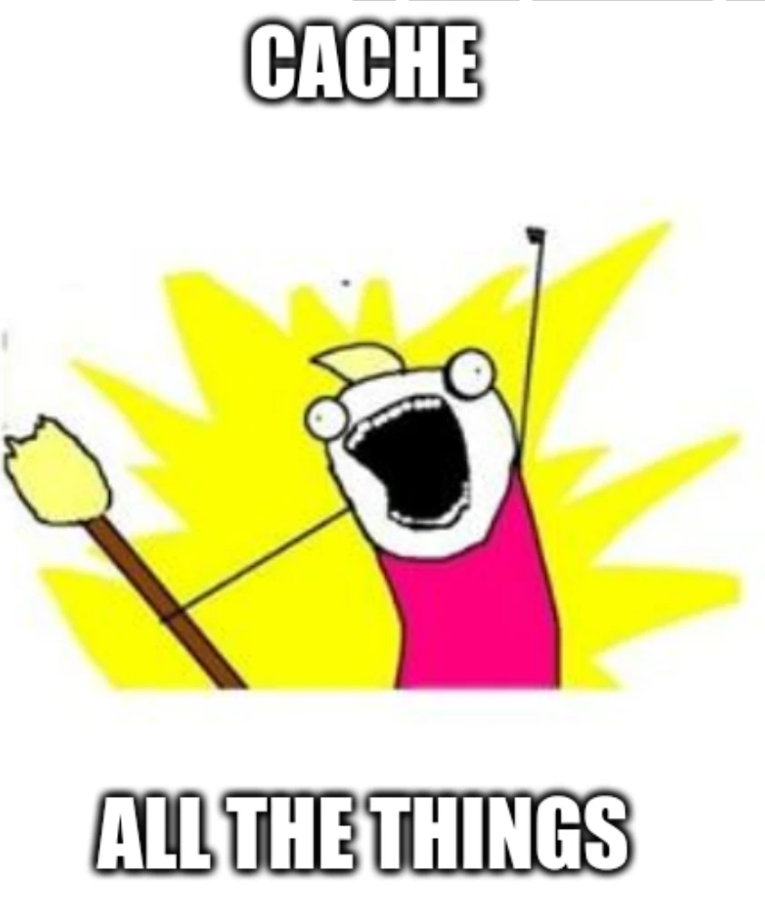

# Bazel, Buildbarn and Bonanza

In the Buildbarn event at Snowflake this week, Ed Schouten presented the work on
the [Bonanza project]. Bonanza is a prototype for a drop in replacement Bazel with
improvements to its communication protocols and written as a client that performs
all of its actions remotely, deduplicated and cacheable.

[bonanza project]: https://github.com/buildbarn/bonanza

# How is it different from Bazel?

Bazel is written in an interesting manner. It is designed from the ground up to
represent a stable description of a build that is reproducible from any
developer's machine. Any developer can check out the same source code ask Bazel
to analyze it and get the exact commands Bazel would run to perform the
build.

This involves a lot of computation: Resolving bazel modules, downloading
repository rules, executing them, analyzing the `.bzl` and `BUILD.bazel` files,
and finally executing the actions themselves.

Bazel internally represents these computation steps as pure functions returning
deterministic values from a stable key, internally represented as `SkyFunctions`
returning `SkyValues` from `SkyKeys`.

A `SkyFunction` should return the same `SkyValue` given the same `SkyKey` which
makes it a good candidate for being computed only once and have the result
cached and fed through to the next step. But peculiarly only the action
execution itself has been offloaded to remote cache and execution.

<!-- truncate -->

This is what Bonanza attempts to resolve. Instead of having all of that state
computed and represented locally, repeated by each developer and discarded
whenever a flag changes, Bonanza is designed from the ground up to offload all
computations, downloads, and analysis to a remote cacheable system. This
essentially reduces the client side to a very light weight program with the
primary purpose of scanning the source code for modifications and uploading any
local changes.

# What's the current state?

The project is still in an early state prototype state. In the presentation Ed
demonstrated how far the prototype has come, and it was very impressive. The
Bonanza client as of today is capable of analyzing the bb-storage codebase.

There is still a lot remaining before it's a production ready system but it is
very impressive progress. Bonanza is capable of running the full `bzlmod`
resolution, fetching all relevant repository rules from upstream, run those
repository rules, and analyzing the resulting codebase, basically performing
everything a Bazel `cquery` does, all with fully remote and cacheable manner.

For shops which lean heavily on remote caching and execution the remaining
local load is often the bottleneck for your builds, the ability to offload the
remaining pieces to your build cluster may be the next evolution of your build
system.
