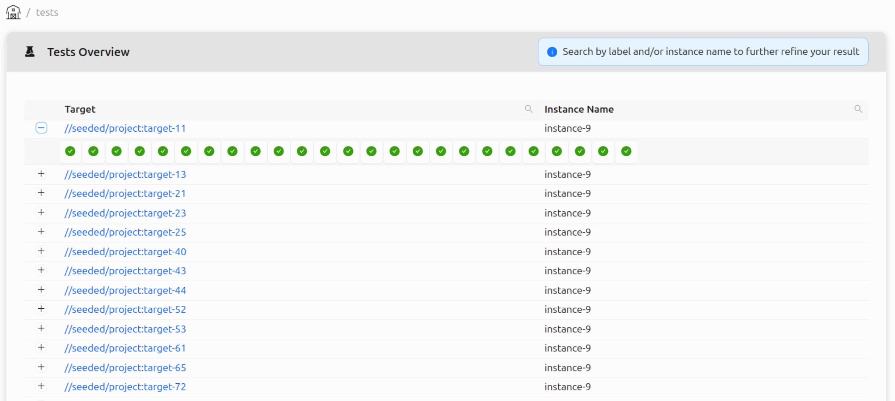

# BB Portal

Since early 2025 we have been hard at work improving the [BB Portal project](https://github.com/buildbarn/bb-portal),
which gives insight into Bazel builds and Buildbarn clusters.

This blog post will showcase the portal and its usefulness. ***TODO: Reword***

## Overview

The portal processes [Build Event Protocol](https://bazel.build/remote/bep) (BEP) data from Bazel
and communicates with Buildbarn through the [storage
daemon](https://github.com/buildbarn/bb-storage) and
[scheduler](https://github.com/buildbarn/bb-remote-execution).

The BEP data contains information about builds, invocations,
tests, and targets; the storage daemon grants information
about the Action Cache (AC) and Content Addressable Storage (CAS);
the scheduler sends information about workers and execution status.

***TODO: Web authentication***

An example setup in of Buildbarn with the portal can be found in [bb-deployments](https://github.com/buildbarn/bb-deployments/):

## Build Event Protocol Data / "Data from Bazel" ***TODO: Reword title***

BEP event data can be retrieved two ways: either from an uploaded file,
or as a stream from Bazel with its [Build Event Service](https://bazel.build/remote/bep#build-event-service)
(BES) protocol, which essentially consists of gRPC encoded BEP events.

***TODO: Authentication (web app)***

### Builds

A BB Portal build is a collection of invocations, grouped my metadata
collected from the executing machine. This is useful when running
Bazel on a CI runner, as the build can be associated with a specific
repository, pull request, or other information pertaining to what
triggered the jobs. The information is often fetched from the
machine's environment variables. The metadata extraction is
configurable to suit different CI systems. The BB Portal repository
includes example configurations for Github Actions, Gitlab,
and Semaphore.

Below is an example view of the builds table using the columns
"Repo", "PR", and "Workflow" from the Github Actions configuration.

***TODO: Build details***

### Invocations

An invocation contains information relating to a single Bazel
command, such as `run`, `build`, or `test`. The BEP events sent
to the portal are processed and saved to the portal's database.
If authentication is configured for the BES service, the user
responsible for the invocation can be saved to the database
and will then be linked to the invocation. The authentication
metadata extraction is configurable.

Each invocation in the portal stores information from the BEP events
such as the command log, targets, action cache and timing metrics, and more.
Similarly to a build, an invocation can be associated with metadata
extracted from the machine running the Bazel command. ***TODO: Rewrite***

### Tests (***TODO***)

### Targets (***TODO?***)

## Action Cache & Content Addressable Storage

The bb-browser has been integrated into the portal, meaning
objects in the AC and CAS can be fetched and displayed.
The portal has almost full feature parity, which is the goal.

***TODO: Authentication and authorization (instance names)***

## Scheduler

* BES insights
* CAS/AC insights (bb-browser integration)
* Authorization (instance names?)

## Builds viewer

* List builds: configurable table
* Build details: Invocation timeline, invocations table

## Tests

* List tests: inline invocation history
* Test details: skip because it's being overhauled?

## Additional backend services

* Prometheus metrics
* Tracing
* Completed actions logger
