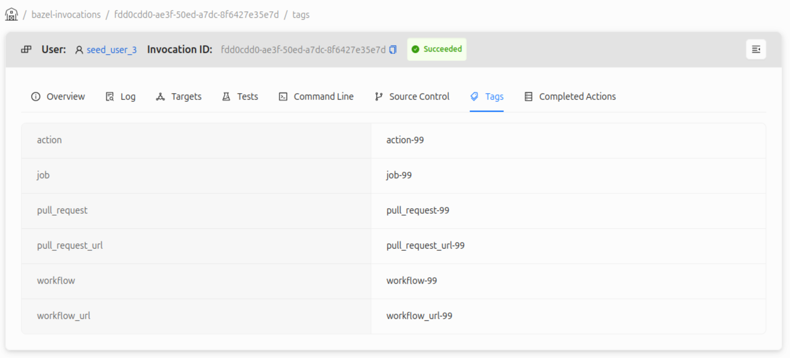
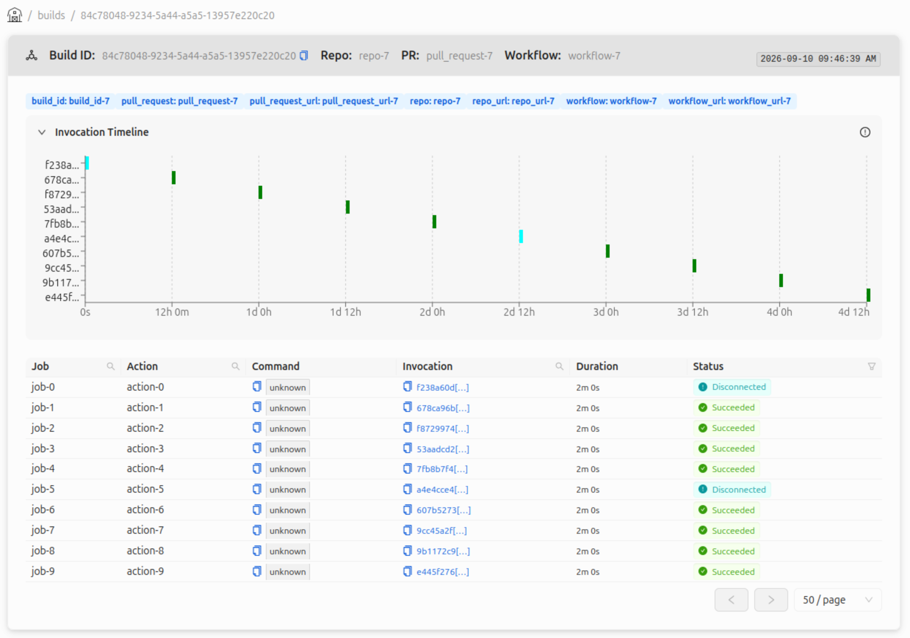
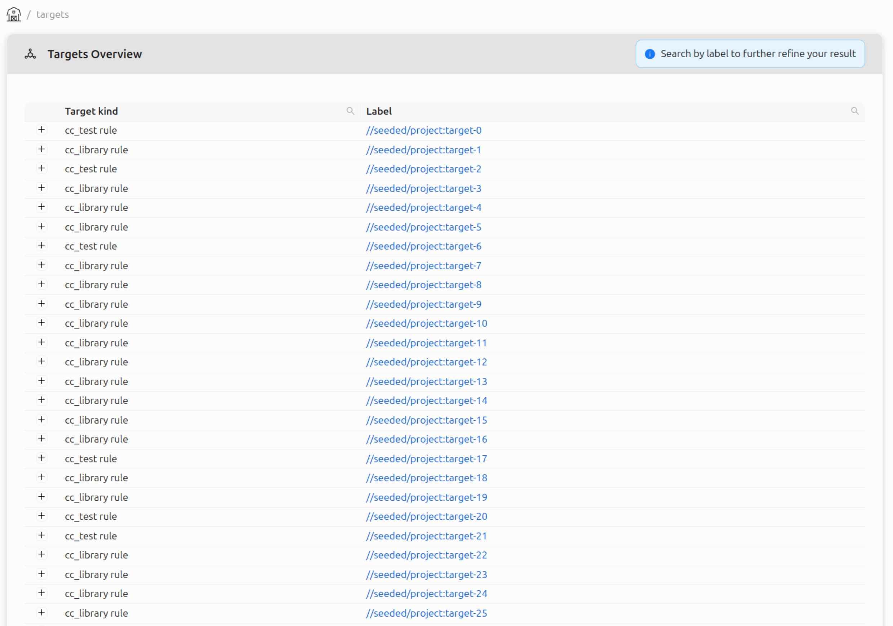
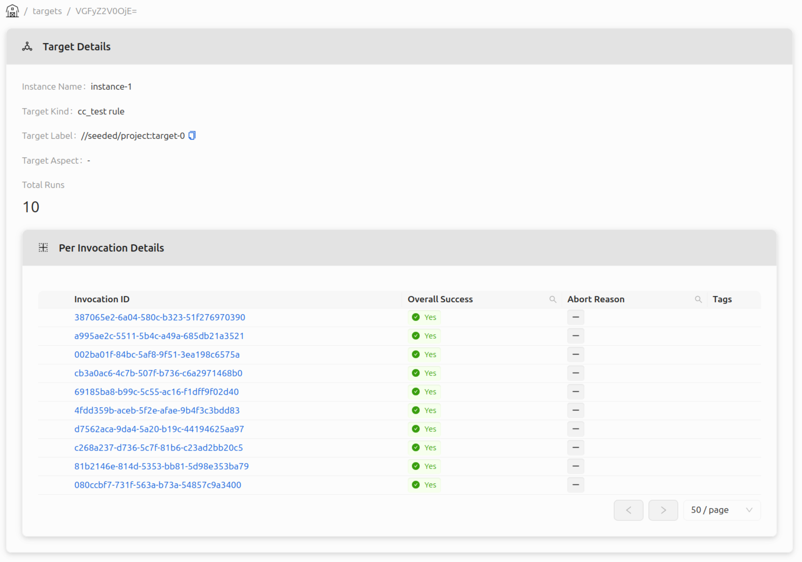
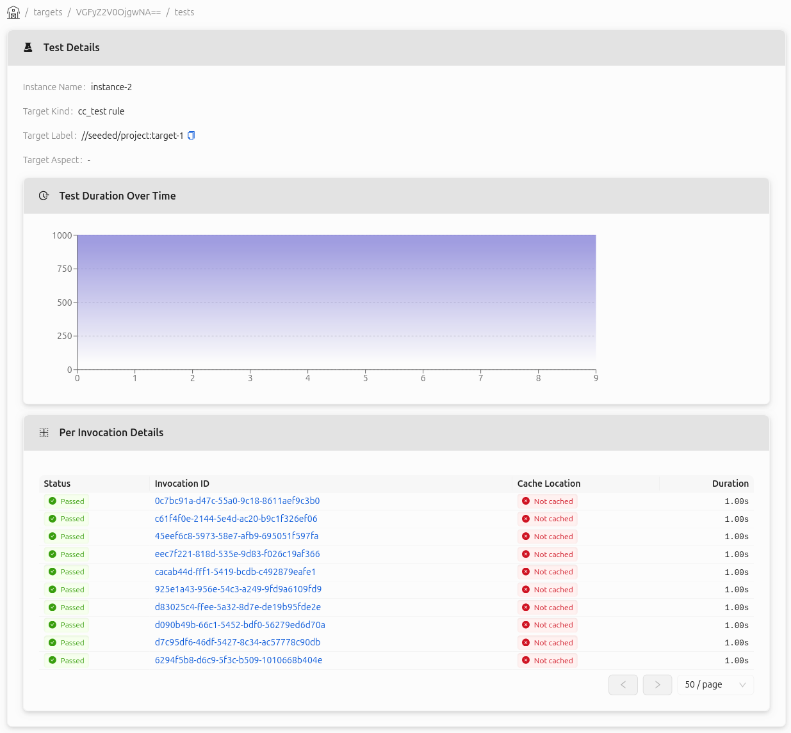
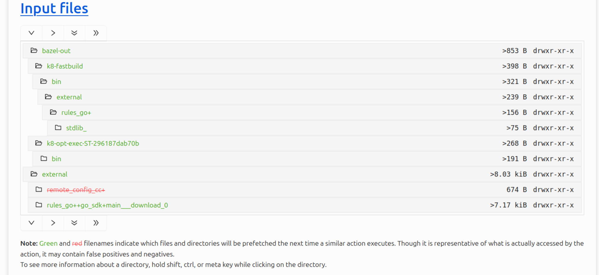
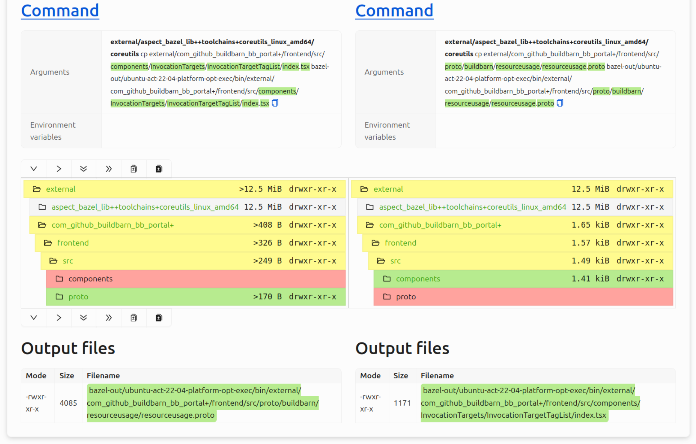
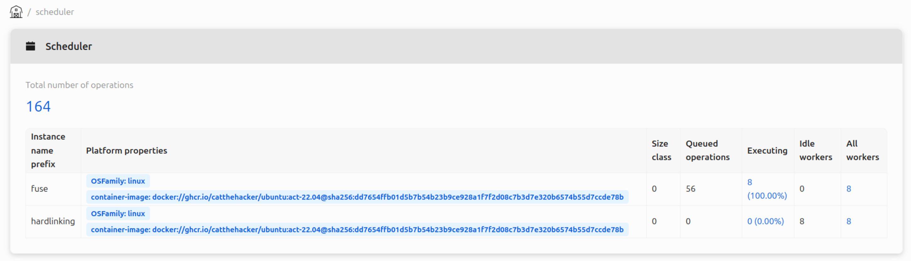

# BB Portal

Since early 2025 we have been hard at work improving the [BB Portal project](https://github.com/buildbarn/bb-portal),
which gives insight into Bazel builds and Buildbarn clusters.

This blog post will showcase the portal and some of it's features. ***TODO: Reword***

## Overview

BB Portal is a web interface for visualizing Bazel builds and Buildbarn
cluster information. The portal processes [Build Event Protocol](https://bazel.build/remote/bep)
(BEP) data from Bazel and communicates with Buildbarn through the [storage
daemon](https://github.com/buildbarn/bb-storage) and
[scheduler](https://github.com/buildbarn/bb-remote-execution).

The BEP data contains information about builds, invocations,
tests, and targets; the storage daemon shares information
about objects in the Action Cache (AC) and Content Addressable Storage (CAS);
the scheduler shares information about workers and execution status.

An example setup in of Buildbarn with the portal can be found in [bb-deployments](https://github.com/buildbarn/bb-deployments/):

Much like other Buildbarn components, the portal's endpoints and services
can be protected by configuring authentication policies and authorizers.
The portal uses instances names to determine database access.

## Build event processing

BEP event data are processed and stored in the portal's database.
The events can be published to the portal in two ways: either from an uploaded file,
or as a stream from Bazel with its [Build Event Service](https://bazel.build/remote/bep#build-event-service)
(BES) protocol, which essentially consists of gRPC encoded BEP events.

### Invocations

An invocation contains information relating to a single Bazel
command, such as `run`, `build`, or `test`. 

Each invocation in
the portal stores information such as the command log, targets,
action cache and timing metrics, and more. If authentication is
configured for the BES service, the user responsible for the invocation
can be saved to the database and will then be linked to the invocation.

An invocation can be associated with metadata extracted from the machine
running the Bazel command. This is useful when running
Bazel on a CI runner, as the invocation can be associated with information
pertaining to what triggered the invocation. The metadata extraction is
configurable to suit different CI systems. A configuration specifies a list
of fields and how they should be set, often retrieved from the machine's
environment variables. Such a field and it's value is called a *tag*.
For example, in the Github Actions configuration included in the BB Portal
repository, tags for pull request, workflow, job, and action are configured,
shown below. The repository also includes example configurations for Gitlab
and Semaphore.

### Builds

A BB Portal build is a collection of invocations, grouped my tags.
Similarly to invocations, the tag value extration configurable.
Below is an example view of the builds table using the Github
Actions example configuration, defining tags for repository,
pull request, and workflow.

Inspecting a specific build displays all it's invocations, shown in a
table or as a timeline.

### Targets and tests (***TODO: This section feels a bit weak***)

All targets are shown in the targets overview, each with a drop-down
list of the targeting invocations' statuses.

Looking at a specific target reveals more details, like the instance name,
aspect, number of total runs, tags, and an abort reason if it exists.

Similarly, all test targets are available in the tests overview.
Inspecting a test target reveals status and durations for each
invocation, and whether the test was cached.

## BB Browser integration

BB Browser has been integrated into the portal, meaning
objects in the AC and CAS can be fetched and displayed.
The portal has almost full feature parity.

Two new features include an inline input file tree display:

and the ability to compare two actions:
(***TODO: This feature is technically not merged upstream yet***).

### BB Scheduler web view integration

The BB Scheduler web UI is integrated into the portal
with full feature parity.

## Additional backend services

The portal backend provides additional services
and interactions.

## Prometheus metrics

The portal can provide a diagnostics endpoint for Prometheus.
Some of the metrics include the total number of invocations,
number of authenticated users, and size/duration of the BEP
event handling traffic.

## Tracing

The portal can be configured to expose an OpenTelemetry OTLP
endpoint, enabling tracing which can be consumed by for example Jaeger.
The traces grant insight into the database and the portal's HTTP
servers.

## Completed actions logger
