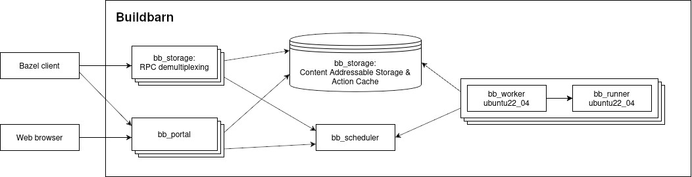
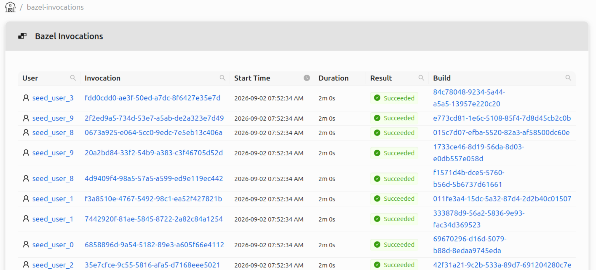
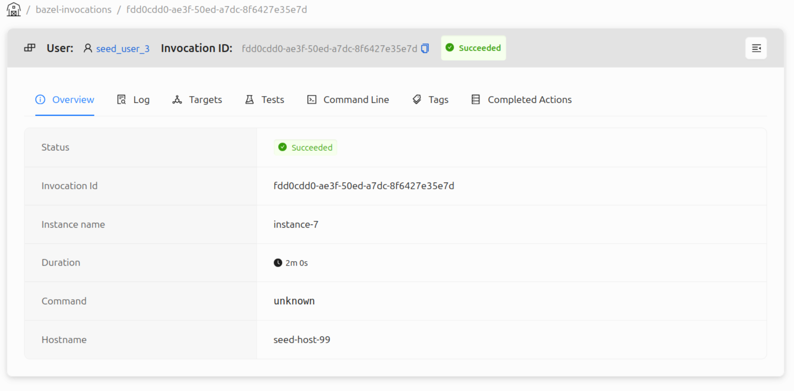

# BB Portal

Since early 2025 we have been hard at work improving the [BB Portal project](https://github.com/buildbarn/bb-portal),
which gives insight into Bazel builds and Buildbarn clusters.

This blog post will showcase the portal and its usefulness. ***TODO: Reword***

## Overview

The portal processes [Build Event Protocol](https://bazel.build/remote/bep) (BEP) data from Bazel
and communicates with Buildbarn through the [storage
daemon](https://github.com/buildbarn/bb-storage) and
[scheduler](https://github.com/buildbarn/bb-remote-execution).

The BEP data contains information about builds, invocations,
tests, and targets; the storage daemon grants information
about the Action Cache (AC) and Content Addressable Storage (CAS);
the scheduler sends information about workers and execution status.

The portal uses instance names to determine what a user can see. ***TODO: Expand.***

An example setup in of Buildbarn with the portal can be found in [bb-deployments](https://github.com/buildbarn/bb-deployments/):

## Build Event Protocol Data / "Data from Bazel" ***TODO: Reword title***

BEP event data can be retrieved two ways: either from an uploaded file,
or as a stream from Bazel with its [Build Event Service](https://bazel.build/remote/bep#build-event-service)
(BES) protocol, which are essentially gRPC encoded BEP events.
The portal incrementally is incrementally updated as it
retrieves and processes the stream. ***TODO: Rewrite***

### Builds

The portal includes a table of all builds. The table columns includes
a build ID and timestamp by default, but can be extended as part of the
portal configuration to suit different CI systems. The build details page
includes a table of all of the build's invocations, and visualizes
them in a timeline. The invocation table columns are also configurable,
as the build table columns. The bb-portal repository includes example
configurations for Github Actions, Gitlab, and Semaphore.

Below is an example view of the builds table using the columns
"Repo", "PR", and "Workflow" from the Github Actions configuration.

### Invocations

***TODO: Invocation overview***

An invocation contains information relating to a single
Bazel command, such as `build` or `test`.

* Associated user
* Logs
* Metrics (Action Cache Overview is getting a rework?)
* Tests (if any)
* Command line
* Configurable Source control
* Configurable build tags

## Action Cache & Content Addressable Storage

The bb-browser has been integrated into the portal, meaning
objects in the AC and CAS can be fetched and displayed.
The portal has almost full feature parity, which is the goal.

## Scheduler

* BES insights
* CAS/AC insights (bb-browser integration)
* Authorization (instance names?)

## Builds viewer

* List builds: configurable table
* Build details: Invocation timeline, invocations table

## Invocations viewer

* Instance name
* List invocations
* User view
* Invocation details: 

## Tests

* List tests: inline invocation history
* Test details: skip because it's being overhauled?

## Additional backend services

* Prometheus metrics
* Tracing
