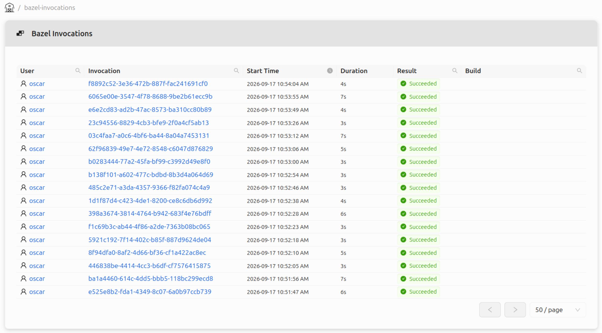
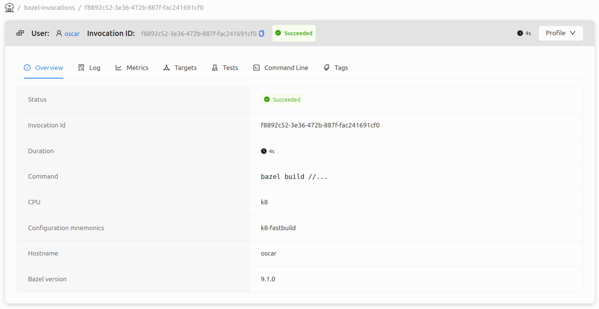
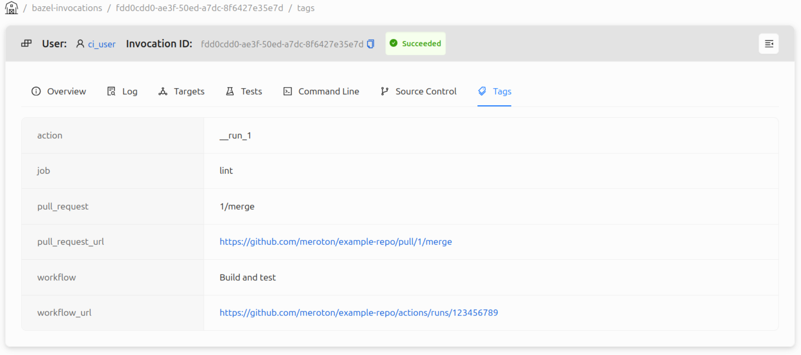
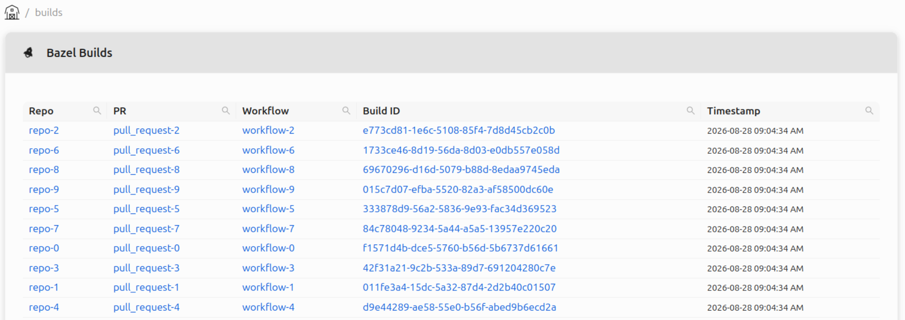
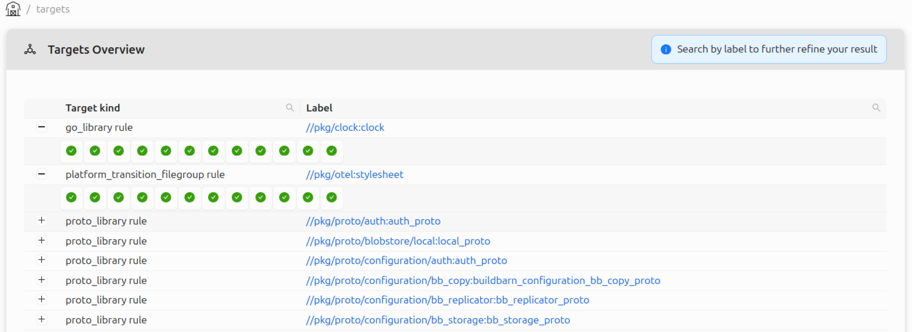
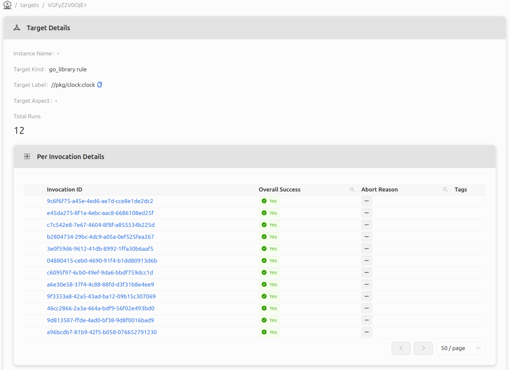
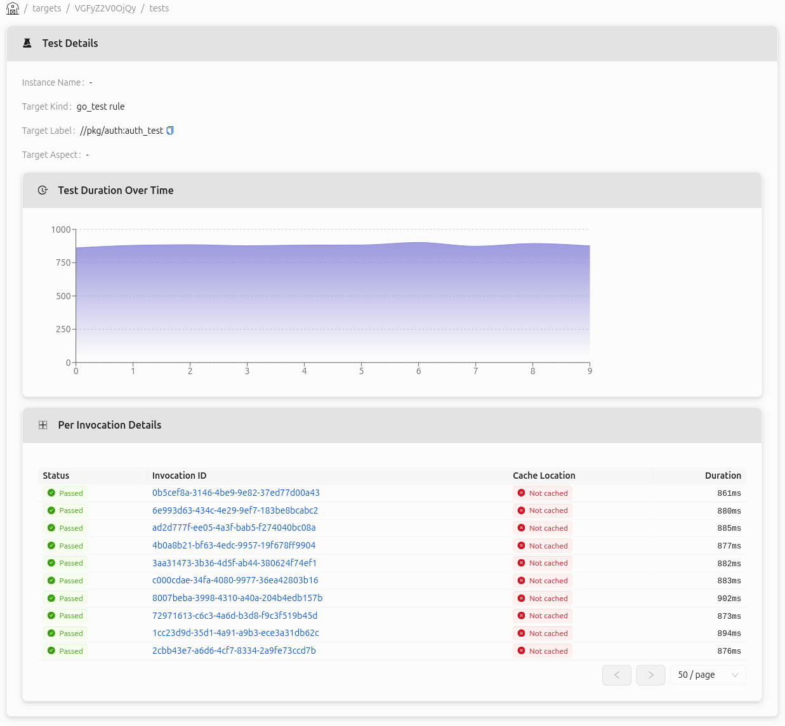
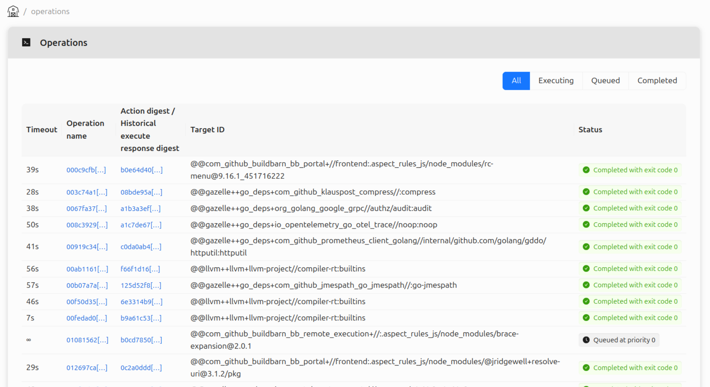
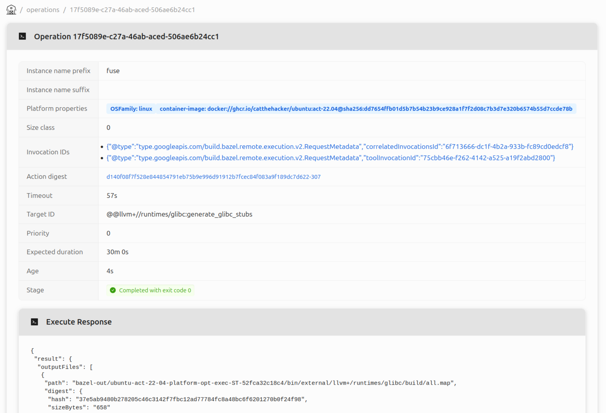

# BB Portal

***TODO: Update date when the post is ready to be published.***

Since early 2025 we have been hard at work contributing to the [BB Portal project](https://github.com/buildbarn/bb-portal),
a web interface which grants insight into Bazel builds and Buildbarn clusters.
This blog post will showcase the portal and some of its features.
In addition to standalone features, the portal integrates the web interfaces for BB Browser and
BB Scheduler, providing a great deal of helpful data in a single place.

## Overview

BB Portal is a web interface for visualizing Bazel builds and Buildbarn
cluster information. The portal processes [Build Event Protocol](https://bazel.build/remote/bep)
(BEP) data from Bazel and communicates with Buildbarn through the [storage
daemon](https://github.com/buildbarn/bb-storage) and
[scheduler](https://github.com/buildbarn/bb-remote-execution).

The BEP data contains information about builds, invocations,
tests, and targets; the storage daemon shares information
about objects in the Action Cache (AC) and Content Addressable Storage (CAS);
the scheduler shares information about workers and execution status.

An example setup of Buildbarn with the portal can be found in [bb-deployments](https://github.com/buildbarn/bb-deployments/):

Much like other Buildbarn components, the portal's endpoints and services
can be protected by configuring authentication policies and authorizers.
The portal uses instance names to determine access.

## Build event processing

BEP event data is processed and stored in the portal's database.
The events can be published to the portal in two ways: either from an uploaded file
created by Bazel using the `--build_event_json_file` flag,
or as a stream from Bazel with its [Build Event Service](https://bazel.build/remote/bep#build-event-service)
(BES) protocol, which essentially consists of gRPC encoded BEP events.

### Invocations

An invocation contains information relating to a single Bazel
command, such as `run`, `build`, or `test`. 

The portal stores invocation data such as the command line, logs, targets,
action cache and timing metrics, and more. If authentication is
configured for the BES service, the user responsible for the invocation
can be saved to the database and will then be linked to the invocation.

An invocation can be associated with metadata extracted from the machine
running the Bazel command. This is useful when running
Bazel on a CI runner, as the invocation can be associated with information
pertaining to what triggered it.

The metadata extraction is configurable to suit different CI systems.
Such a configuration specifies a list of fields and how they should be set,
often retrieved from the machine's environment variables. These fields are referred to as "tags".
For example, in the Github Actions configuration included in the BB Portal
repository, tags for pull request, workflow, job, and action are configured,
shown below. The repository also includes example configurations for Gitlab CI/CD
and Semaphore.

### Builds

A BB Portal build is a collection of invocations, grouped by tags.
Similarly to invocations, tag extractions are configurable.
Below is an example view of the builds table using the Github
Actions example configuration, defining tags for repository,
pull request, and workflow.

Inspecting a specific build displays all its invocations, shown in a
table and timeline.

### Targets and tests

All targets are shown in the targets overview, each with a drop-down
list of its recent invocation results.

Looking at a specific target reveals more details.

If the target is a test target, additional metrics are available.

## BB Browser integration

BB Browser has been integrated into the portal, meaning
objects in the AC and CAS can be fetched and displayed.
The portal has almost full feature parity.

A new feature allows the input files to be displayed as an
inline tree:

## BB Scheduler web UI integration

The BB Scheduler web UI is integrated into the portal
with close to full feature parity.

## Additional services for cluster operators

The BB Portal backend provides additional services
and interactions.

### Prometheus metrics

The portal can provide a diagnostics endpoint for Prometheus.
Some of the metrics include the total number of invocations,
number of authenticated users, and size and duration of the BEP
event handling traffic.

### Tracing

The portal can be configured to expose an OpenTelemetry OTLP
endpoint, enabling tracing that can be consumed by tools like Jaeger.
The traces grant insight into the database queries and the portal's HTTP
servers, making it possible to debug bottlenecks.
