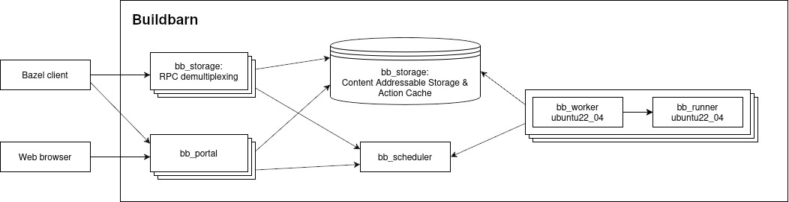
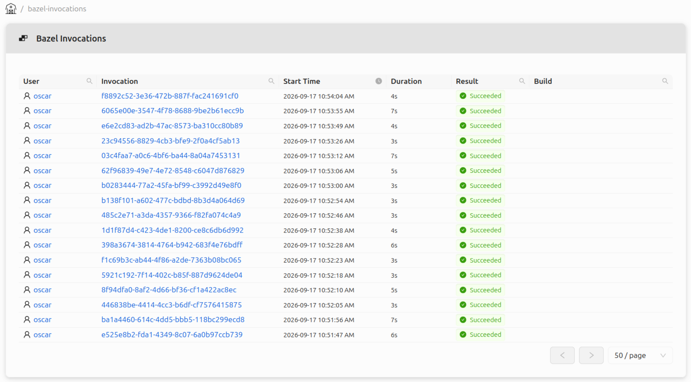
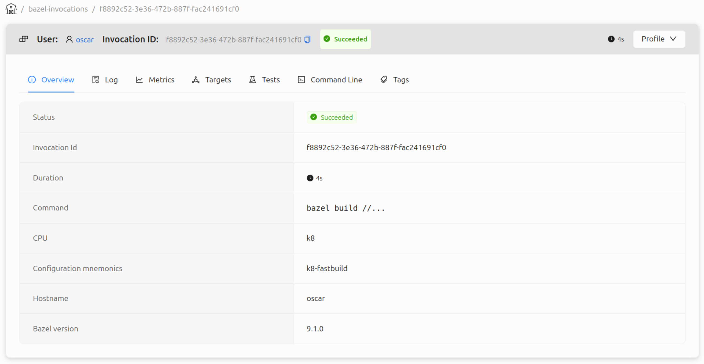
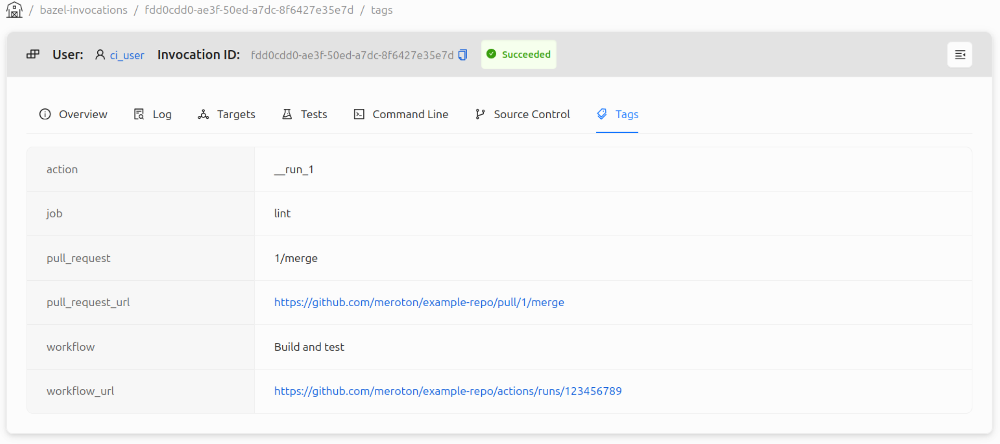
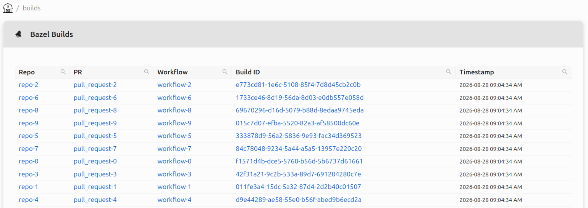
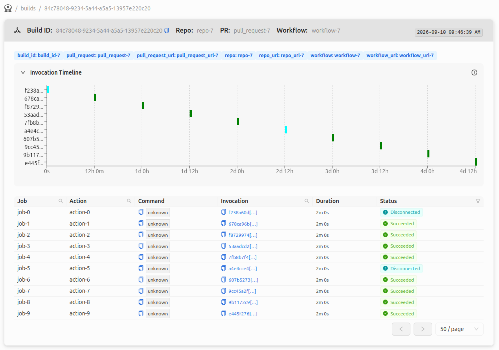
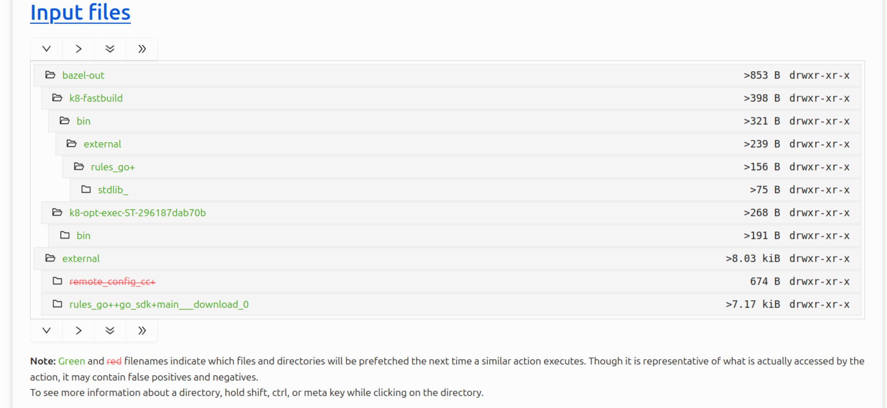
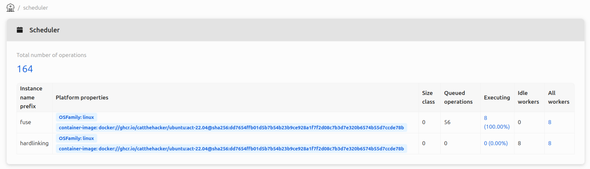
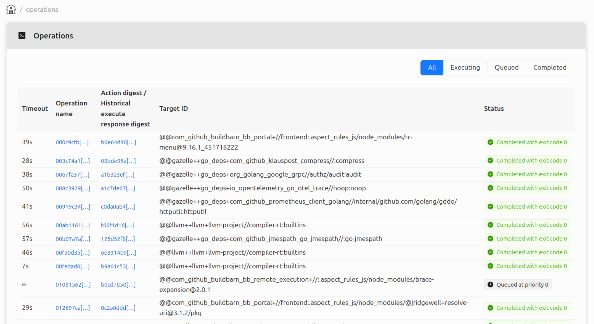
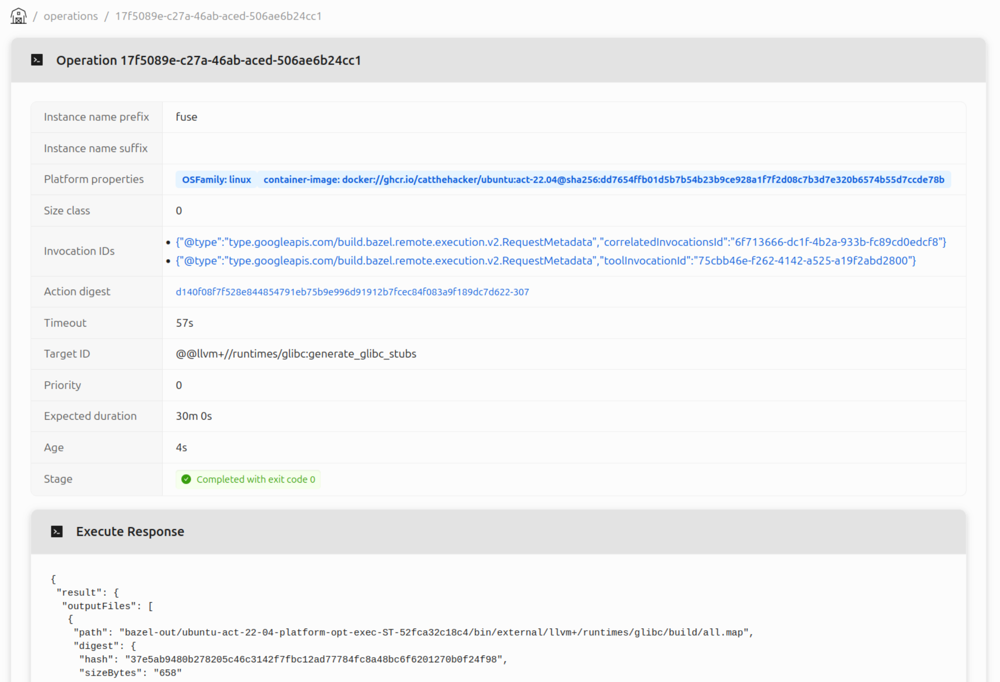

# BB Portal, a Buildbarn Web UI

We have been hard at work contributing to the [BB Portal
project](https://github.com/buildbarn/bb-portal), a web interface which grants
insight into Bazel builds and Buildbarn clusters. This blog post will showcase
the portal and some of its features. In addition to standalone features, the
portal integrates the web interfaces for BB Browser and BB Scheduler, providing
a great deal of helpful data in a single place.

## Overview

BB Portal is a web interface for visualizing Bazel builds and Buildbarn cluster
information. The portal processes [Build Event
Protocol](https://bazel.build/remote/bep) (BEP) data from Bazel and communicates
with Buildbarn through the [storage
daemon](https://github.com/buildbarn/bb-storage) and
[scheduler](https://github.com/buildbarn/bb-remote-execution).

The BEP data contains information about builds, invocations, tests, and targets;
the storage daemon shares information about objects in the Action Cache (AC) and
Content Addressable Storage (CAS); the scheduler shares information about
workers and execution status.

An example setup of Buildbarn with the portal can be found in [BB
Deployments](https://github.com/buildbarn/bb-deployments/):

Much like other Buildbarn components, the portal's endpoints and services can be
protected by configuring authentication policies and authorizers. The portal
uses instance names to determine access.

The portal runs as a stateless application which persists build events in a
PostgreSQL database, simplifying the operational management of the application.
If not configured for ingesting build events the portal can be deployed without
a database.

BB Portal is capable of running at large scale and will only require a handful
of cores to serve thousands of developers.

## Build event processing

BEP event data is processed and stored in the portal's database. The events can
be published to the portal in two ways: either from an uploaded file created by
Bazel using the `‑‑build_event_json_file` flag, or as a stream from Bazel with
its [Build Event Service](https://bazel.build/remote/bep#build-event-service)
(BES) protocol, which sends the same BEP events over gRPC.

### Invocations

An invocation contains information relating to a single Bazel command, such as
`run`, `build`, `query`, or `test`. 

The portal stores the invocation data sent over by Bazel like the command line,
logs, targets, build metrics, and more. If authentication is configured for the
BES service, the user responsible for the invocation can be saved to the
database and will then be linked to the invocation.

An invocation can be associated and grouped based on metadata extracted from the
machine running the Bazel command. This is particularly useful when running
Bazel on a CI runner as the invocations can more easily be traced to what
triggered it.

The metadata extraction is configurable to suit different CI systems. A
configuration specifies a set of tags and how they should be extracted from the
machine's environment variables. In the BB Portal repository a predefined
metadata extractor for Github Actions is available which adds tags for pull
request, workflow, job, and action. The repository also includes example
configurations for Gitlab CI/CD and Semaphore.

### Builds

A BB Portal build is a collection of invocations, grouped by tags. Similarly to
invocations, tag extractions are configurable. Below is an example view of the
builds table using the Github Actions example configuration, defining tags for
repository, pull request, and workflow.

Inspecting a specific build displays all its invocations, shown in a table and
timeline. This allows users to more easily see all the invocations pertaining to
a particular pull request or commit giving users a natural place to explore a CI
run.

## BB Browser integration

The portal functions as a drop in replacement of BB Browser using the same URL
schema allowing users to interactively explore actions and results and even
compare multiple action results with each other.

## BB Scheduler web UI integration

The portal also functions as a drop in replacement for the BB Scheduler web UI
using the scheduler's build queue state API to gather and visualize the same
information.

