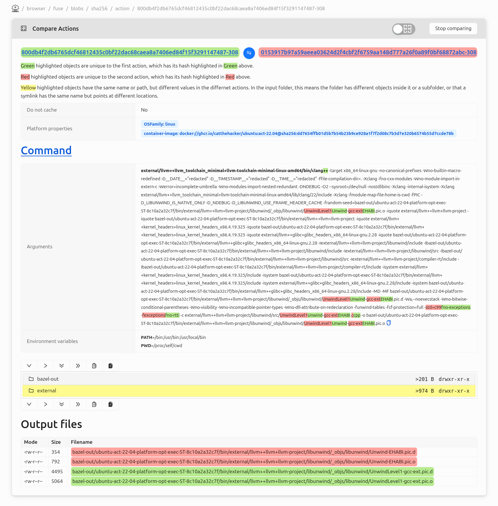
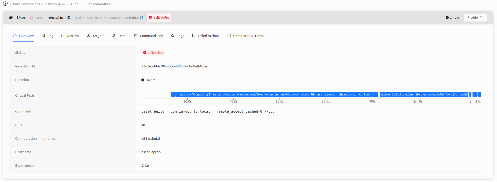
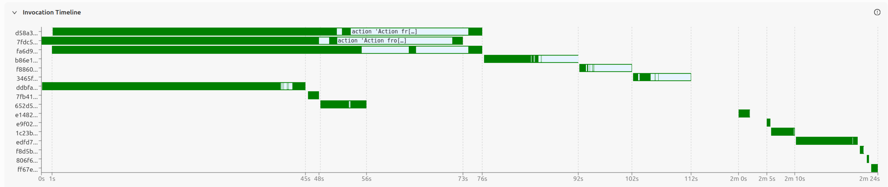
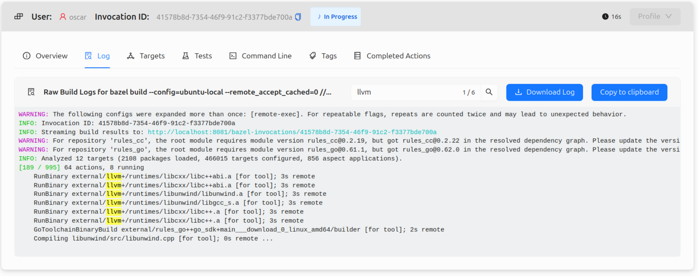

The example configuration for
[bb-deployments](https://github.com/buildbarn/bb-deployments/) has been updated.

This update will explain some of the changes since since our [last update
summary](/blog/bb-deployments-updates-2026-06), covering what has happened since
June 2026.

Additional changes can be found in the [bb-deployments
changelog](https://github.com/buildbarn/bb-deployments/blob/d4a6ca38e5f77959b42fccaa34a3320253683bc2/changelog.md#2026-09-28).

### [Restructure BB Portal configuration (Sep 17, 2026)](https://github.com/buildbarn/bb-portal/commit/a7cccc3d9f70e2231036d5be1d62a2c511b9beb3)

The BB Portal configuration has been restructured to decrease coupling between
services. This change has meant:

* Include the database cleanup configuration part in the database configuration
* Remove configuration option to enable GraphQL Playground, which is now enabled
  by default
* Add individual authorizers for the portal's services and configured Buildbarn
  components

These are breaking changes that makes removes some of the unnecessary
dependencies in the configuration.

### [BB Portal action comparison view (Sep 16, 2026)](https://github.com/buildbarn/bb-portal/commit/acdee57d5114fbc70206237deb625ea430177aba)

It is now possible to compare two actions, making it easier to see differences
in inputs, outputs, and other properties pertaining to the action.

In addition to the merged mode shown above, a side-by-side view is also
available.

### [Set proxy URL from environment (Sep 4, 2026)](https://github.com/buildbarn/bb-storage/commit/d825f0c474db8974e3325ab044b1716881b777bb)

A option has been added for Buildbarn's HTTP client configuration, which ensures
that proxy URLs are fetched from the environment variables instead of
configuring it inline. This is enabled by setting the configuration option
`proxyFromEnvironment: {}` instead of `proxyUrl: <url>`.

### [Display critical path in BB Portal (Aug 31, 2026)](https://github.com/buildbarn/bb-portal/commit/ac1882cf807be89dc85bd705f73e193925486915)

An invocation's critical path is now visualized directly in the invocation
overview.

The critical paths is also shown in the invocation timeline for a build.

This information was previously only available in the invocation profile; from
the invocation overview, the profile can be downloaded or opened in Perfetto.

### [Add search bar to BB Portal log viewer (Aug 31, 2026)](https://github.com/buildbarn/bb-portal/commit/3a389417711b721861269d92218a7029dfa37635)

An inline search bar has been added to the log viewer. The functionality of the
browser's native page search is limited, as it can only search the visible text.

### [Tool for partitioning ephemeral disks (Jun 23, 2026)](https://github.com/buildbarn/bb-storage/commit/b4bd7983de1a48d20942d741d5190ec533b76e24)

BB Storage now includes a tool for creating a single block device containing
seperate block devices for the CAS, AC, etc. See the [Proto
file](https://github.com/buildbarn/bb-storage/blob/b4bd7983de1a48d20942d741d5190ec533b76e24/pkg/proto/configuration/partition_ephemeral_disks/partition_ephemeral_disks.proto)
for configuration options.
